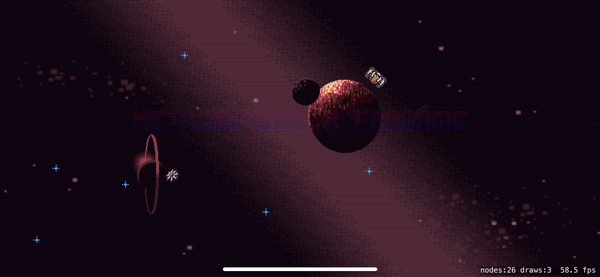

# metroidvaniafangame

Written by Nicholas VanCise, credit for art and base assets provided below.

This is a simple 2d platformer fan game, all nintendo art assets do not belong to me, editing of assets was done by me. 
I have written the event driven animation scheme, collision detection, character physics, scene architecture, and game logic. 
This game is targeted for iphone 8 through XS, and uses a MVC pattern.

Technical details:

-To minimize code duplication, each scene is set up using inheritance and encapsulation. Everything needed for the scene to function is initialized in the base level (lvl1). If the demands of the level require different logic, the base functions should be overridden. If this is unfeasable, the new logic should be encapsulated with the object it relates to and should be added to an overridden base function.

-This app makes use of the third party library JSTileMap to parse Tiled TMX tile maps. Each map was designed in the TILED TMX editor.

-Multithreading (background tasks provided by Spritekit/GCD) is used to smoothly transition between scenes, to preload assets without blocking the UI while transitioning, and to handle UI elements that use autolayout.

-This app uses a fuzzy logic rule system (GKRuleSystem) to quickly evaluate standard game logic for bosses and more complex enemies which provide the framework for fuzzy logic to be applied if more complex enemy action is needed. The NSPredicate query language is used to access state information about enemies using this system.

-To minimize tile collisions, instead of using a physics based tile collision system (SpriteKit), I have utilized a tile collision algorithm that checks if a collision has occured within the 8 tiles adjacent to the player, thus the only information needed is the players position and the layers where collisions may occur (no physicsbodies required, and no alternate array required).

-The collision system has two main components, player contact with enemies, and enemy contact with player. This allows different types of collisions from the player to enemies, and enemies to player (different attacks/projectiles with different specifications for each). Inheritance is used to reduce the number of comparisons and casts within the collision detection funciton.

-This app uses GKAgents (GameplayKit) in conjunction with SpriteKit to create event driven autonomous flocking behavior that simulates real-world physical movement and targeting using GKAgents, and dynamic wandering (ex. honeypot, waver). This behavoir is lightweight and requires no physicsbodies/external nodes attatched to the target, and is integrated with the collision detection system for applicable enemies.

-Audio management of this game has been encapsulated in a class designed as a component of each scene (gameaudio.m). This class makes use of AVFoundation, specifically AVAudioPlayer and its related functions, along with GCD and a simple queue to play sounds asychronously. This allows relevent audio to be preloaded with each scene, and the load on the main thread and memory is as small as possible.

-NSNotificationCenter is used to handle the scene as the app transitions between background and active states.

-The joystick was implemented from scratch in joystick.m and allows 5-directional movement. This scheme is disconnected from the player animation, while providing inputs for the player physics (player x and +y vectors).

-Saving data is implemented as a singleton that saves its state to disk by conforming to the NSSecureCoding protocol. 

The gifs may take some time to load due to the filesize, any FPS tags are slower than on actual device (gifs captured using third party software).

    Credits for art assets ripped by:

    Garact Jownson-Some background objects from metroid fusion

    Midiwaffle-Crateria tileset

    FlamingCobra-TRO Tileset

    B Hopkins & Captain Invictus-samus normal suit

    Ray Wenderlich.com-Base super mario assets (1st lvl)

    Tommy Lee-"honeypot" walking cactus enemy, metroid sprite (used as volume slider)

    N-finity-Arachnus boss, Waver enemy, Choot enemy, Sciser enemy, Nettori boss

    ansimuz-Space parallax backround (menu scene background)

    Bob Bobium-Human Station Menuscene (space colony ceres), Door sprites

    Greiga Master-Chozo Statue, Nettori boss, Dessgeega

    Cha0sMiles07 & Ngamer-Samus Projectile sprites
    
    Rogultgot-Space Pirate sprites

    Some labels were made using fontmeme.com

    Credit for music:

    BurghRecords-Dystopian Future Fx Sounds (used in menuscene, background music) liscensed under Creative Commons 0 Liscense

    Micah Young-Lost Moon's Grateful Eights (used in lvl1, background music) liscensed under Creative Commons Attribution Liscense

    Yung Kartz-Lonely, Aye licensed under a Creative Commons Attribution-NonCommercial-NoDerivatives 4.0 License.

    254beats-Trap-2017, Trap Beat 2017 Dope Rap_Trap Instrumental sourced from Mdundo
